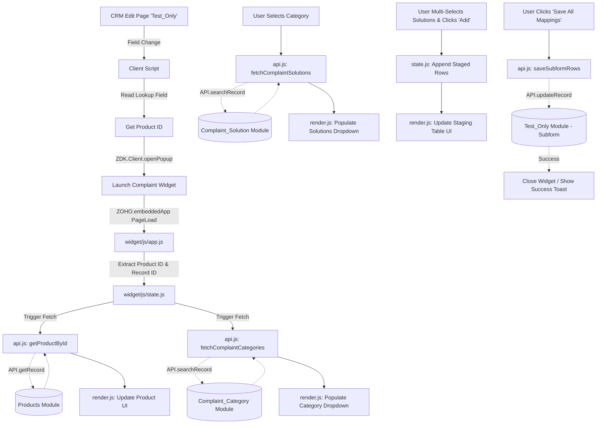

# Complaint & Solution Mapping — Zoho CRM Widget

## 1. Project Overview

- **Project Purpose**: Provide an interactive UI inside Zoho CRM to map specific products to complaint categories and corresponding solutions, and save these mapped combinations into a subform on a CRM record.
- **Project Type**: Zoho CRM Embedded Widget (opened via Client Script on an Edit Page)
- **Technology Stack**: HTML5, Vanilla CSS, Vanilla JavaScript (ES6 Modules)
- **CRM Integration**: `ZOHO.embeddedApp` (for initialization and PageLoad context), `ZOHO.CRM.API` (for data fetching and updating).
- **Current Functionality**: 
  - Receives `productId` and `recordId` from a Client Script.
  - Fetches Product details from the `Products` module.
  - Fetches associated `Complaint_Category` records based on the Product.
  - Dynamically fetches `Complaint_Solution` records when a Category is selected.
  - Allows users to multi-select solutions, stage them in a table, and save them as subform rows into the `Test_Only` module via API update.
- **Intended Users**: CRM Users dealing with product complaints/tickets who need a guided mapping interface.

---

## 2. Executive Summary

This project is a custom **Zoho CRM Embedded Widget** designed to streamline the logging of product complaints. 

It is launched dynamically from the `Test_Only` module's Edit Page using a **Zoho CRM Client Script**. When a user changes a specific field (e.g., status to "In Progress"), the Client Script reads the selected Product from a lookup field and opens this widget in a popup, passing along the `productId` and `recordId`.

Once the widget opens, it automatically:
1. Connects to the CRM using the Zoho SDK.
2. Uses the provided `productId` to pull the actual Product Name, Code, and Description from the CRM database to display to the user.
3. Queries the CRM to find which `Complaint_Category` records are linked to this specific product.
4. Allows the user to select a category, which then triggers a query to fetch the specific `Complaint_Solution`s for that category.
5. The user can pick multiple solutions and stage them in a local table.
6. Finally, clicking **"Save All Mappings"** takes the staged rows and uses the Zoho API to write the Complaint and Solution IDs directly into the subform of the target `Test_Only` record.

---

## 3. Technology Stack

### Frontend Core
- **Vanilla JavaScript (ES6 Modules)**: Used for all application logic. The code is modularized into API handlers, DOM events, state management, and rendering logic. Chosen for its lightweight nature without the overhead of React or Vue.
- **HTML5 & Vanilla CSS**: UI layout is completely custom, using CSS variables for theming, Flexbox/Grid for layout, and SVGs for icons. No external frameworks (like Tailwind or Bootstrap) are used, ensuring extremely fast load times inside the Zoho iframe.

### Zoho SDK & CRM Integration
- **Zoho CRM Widget SDK (`ZohoEmbededAppSDK.min.js`)**: The bridge between the iframe widget and the parent CRM window.
- **`ZOHO.embeddedApp.init()`**: Bootstraps the application and listens for the `PageLoad` event to receive context (the `productId` from the Client Script).
- **`ZOHO.CRM.API`**: Used for all database transactions. Specifically:
  - `getRecord` (Products)
  - `searchRecord` (Complaint Categories & Solutions via COQL/Search syntax)
  - `updateRecord` (Saving the subform rows back to the module)

---

## 4. Complete Folder Structure

```text
project-root/
├── PROJECT_DOCUMENTATION.md      # This documentation file
├── plugin-manifest.json          # Zoho CRM widget configuration/manifest
└── widget/                       # The actual widget source directory served to Zoho
    ├── index.html                # Main HTML entry point containing UI and inline CSS
    ├── widget.html               # Duplicate/Legacy entry point
    ├── css/                      
    │   └── styles.css            # External stylesheet (Planned / Optional, styles currently inline)
    ├── js/                       # Core application logic
    │   ├── api.js                # CRM API interaction layer
    │   ├── app.js                # App initialization and PageLoad listener
    │   ├── constants.js          # Hardcoded API module and field names
    │   ├── events.js             # DOM Event listeners (clicks, inputs)
    │   ├── render.js             # DOM manipulation / UI rendering
    │   ├── state.js              # Global state management and Pub/Sub
    │   ├── utils.js              # Logging, Toast notifications, and sanitization
    │   └── ZohoEmbededAppSDK.min.js # Local fallback copy of the SDK
    ├── mock/
    │   └── data.js               # Mock data for local testing (Planned / Not Currently Implemented)
    ├── sdk/
    │   └── ZohoEmbededAppSDK.min.js # Local SDK duplicate (Needs Verification on active usage)
    └── translations/
        └── en.json               # Localization strings (Planned / Not Currently Implemented)
```

---

## 5. File-by-File Architecture

### `widget/js/api.js`
**Purpose**: Manages all outgoing network requests and Zoho CRM API interactions.
**Responsibilities**: Abstracts the Zoho SDK calls so the rest of the app doesn't need to know how the CRM API works.
**Important Functions**:
- `getProductById(productId)`: Fetches product info from the `Products` module. Called on initialization.
- `fetchComplaintCategories(productId, productName)`: Searches the `Complaint_Category` module for records matching the provided product.
- `fetchComplaintSolutions(complaintId)`: Searches the `Complaint_Solution` module for records tied to the selected category.
- `saveSubformRows(recordId, rows)`: Takes the staged table mappings, formats them into a Zoho subform payload, and calls `ZOHO.CRM.API.updateRecord` on the `Test_Only` module to save them.

### `widget/js/app.js`
**Purpose**: The main lifecycle and initialization controller.
**Responsibilities**: Starting the app and establishing the connection with Zoho CRM.
**Important Functions**:
- `initialize(data)`: Triggered by `ZOHO.embeddedApp.on("PageLoad")`. It extracts the `productId` and `recordId` from the Client Script payload, logs confirmation, and saves these IDs into the global state to trigger the initial data fetch.

### `widget/js/state.js`
**Purpose**: Global state management using a lightweight Publisher/Subscriber pattern.
**Responsibilities**: Holds the singleton `state` object (current product, dropdown data, selected mappings, table rows).
**Important Functions**:
- `setState(newState)`: Merges new data into the global state and automatically notifies all subscribed listeners (primarily `render.js`) to update the UI.
- `subscribe(listener)`: Allows the view layer to listen for state changes.

### `widget/js/render.js`
**Purpose**: The View Layer (DOM manipulation).
**Responsibilities**: Listens to `state.js` and updates the DOM safely. Contains no business logic, only UI updates.
**Important Functions**:
- `renderApp(state)`: The master render function that calls sub-renderers.
- `renderProductInfo(state)`: Updates the top product metadata card.
- `renderComplaintDropdown(state)` & `renderSolutionsDropdown(state)`: Populates the dropdown lists.
- `renderStagingTable(state)`: Re-draws the subform table rows based on `state.rows`.

### `widget/js/events.js`
**Purpose**: UI interaction controller.
**Responsibilities**: Binds all HTML `click`, `input`, and `change` event listeners in one place.
**Important Notes**: When a user interacts with the UI, this file captures the event, performs logic, and calls `setState()`, which in turn triggers `render.js`.

### `widget/js/constants.js`
**Purpose**: Central configuration.
**Responsibilities**: Holds all Zoho CRM Module API names (`Test_Only`, `Products`, `Complaint_Category`, `Complaint_Solution`) and Field API names to prevent typos and make future schema changes easy.

### `widget/index.html`
**Purpose**: The structural backbone of the widget.
**Responsibilities**: Defines the HTML skeleton and CSS variables. Uses robust Flexbox architecture with `flex-shrink: 0` to ensure panels do not collapse in constrained modal heights.

### `widget/js/ZohoEmbededAppSDK.min.js`
**Purpose**: Official Zoho SDK.
**Important Notes**: Do NOT edit this file. It provides the core `ZOHO` namespace object required to talk to the parent CRM window. It is typically loaded via CDN in `index.html`.

---

## 6. Architecture & Data Flow Diagram



## 7. How to Modify or Debug

- **Changing Modules/Fields**: If a Zoho Field API Name changes, update `widget/js/constants.js`. Do not hunt through the codebase for hardcoded strings.
- **Debugging API**: All Zoho API calls in `api.js` have localized `catch` blocks and use the `log.error` utility from `utils.js`. If data isn't loading, check the browser console for exact API response errors.
- **UI Tweaks**: The UI is styled with CSS inside `index.html`. Modify the CSS variables (`:root`) for quick theme adjustments.
- **Local Testing**: The project is designed to be served locally via Zoho Extension Toolkit (`zet run`). Ensure you are modifying files in the `widget/` directory, as that is what the plugin manifest serves.
